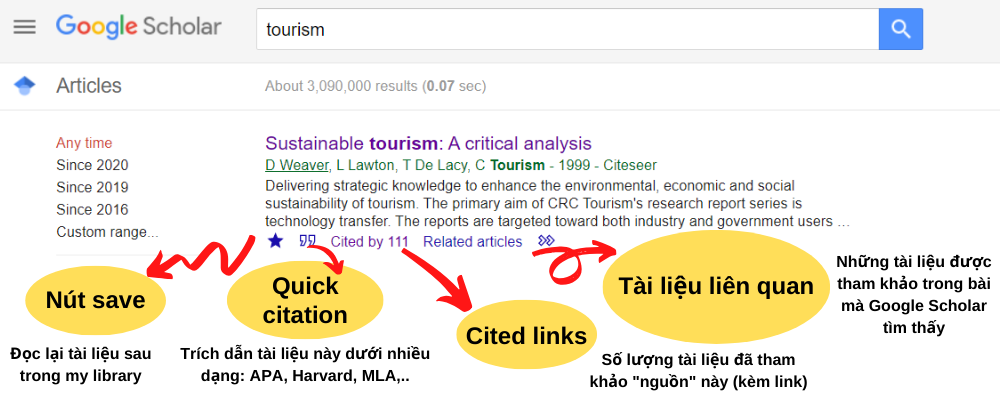
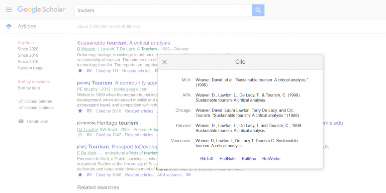
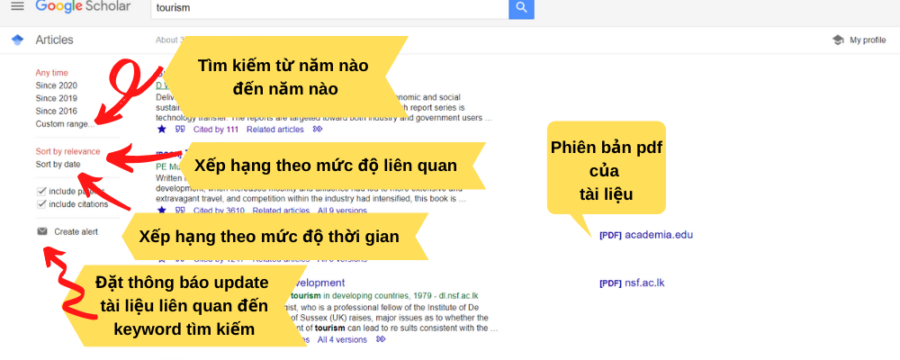
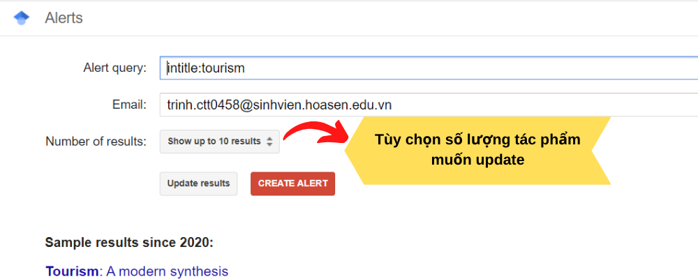
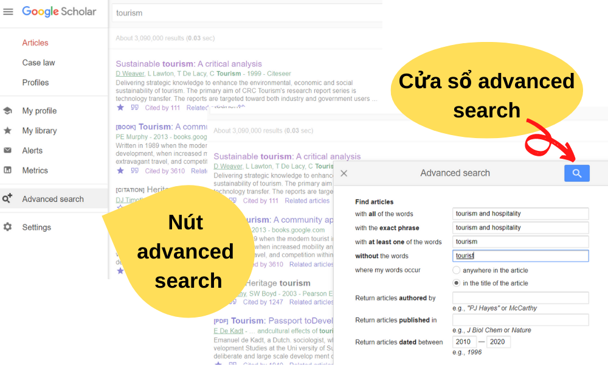
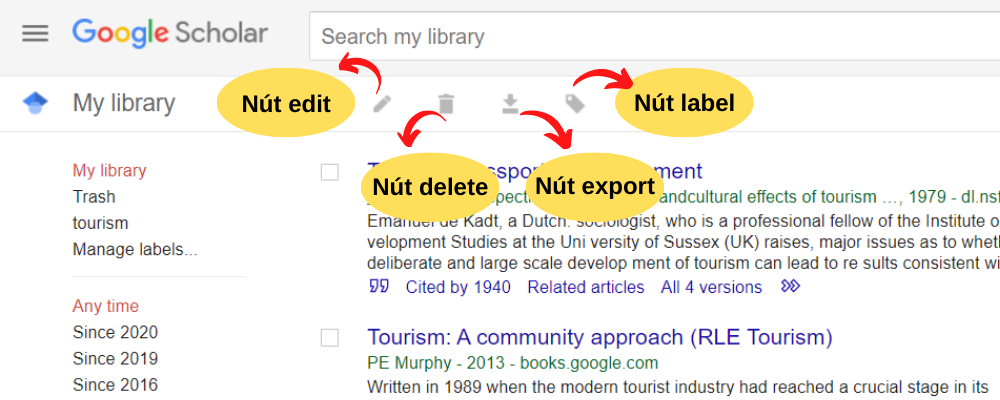

# Cách sử dụng google scholar
## I. Giao diện tìm kiếm của google scholar:
- Các nút công cụ


- Giao diện Quick citation


- Bộ lọc tìm kiếm


- Chức năng Create alert: Đặt thông báo để update các tài liệu liên quan đến keyword bạn quan tâm. Sau khi nhấn nút, cửa sổ bên dưới sẽ hiện ra và có thể điều chỉnh giới hạn hoặc tăng cường số lượng tác phẩm muốn update


- Chức năng Advanced search: giúp tinh chỉnh kết quả thông qua việc tìm kiếm chính xác keyword liên quan khác. Ngoài ra, advanced search còn giúp giới hạn thời gian, tác giả và nhà xuất bản


## II. My library trên Google scholar
- My library là nơi lưu trữ những tài liệu bạn đã bấm nút save để đọc lại sau


- Trong đó:
    - Delete: xóa tài liệu đã lưu
    - Export: xuất citation tác giả của bài
    - Edit: chỉnh sửa tến tác giả, tác phẩm hiển thị 
    - Label: sắp xếp tài liệu được chọn vào thư mục đã tạo với tên riêng
    - Trong label cung cấp create new để tạo thư mục mới và manage label để quản lý

## III. Tìm kiếm với google scholar
### 1 Một số mẹo tìm kiếm google scholar
- Chèn năm: Nếu bạn muốn tìm tài liệu sxuất bản trong 1 năm cụ thể, hãy chèn năm vào keyword hoặc trích dẫn nguyên văn
- Sử dụng keyword thay vì câu: Nhiều tác phẩm liên quan sẽ được hiển thị hơn khi tìm kiếm bằng keyword thay vì câu
- Tìm kiếm cụ thể với trích dẫn nguyên văn: Hãy sử dụng dấu ngoặc kép xung quanh trích dẫn nguyên văn. Nếu không, google scholar sẽ không hiểu việc bạn đang muốn tìm tài liệu chứa đúng trích dẫn này. Thay vào đó, google scholar sẽ hiển thị tài liệu chứa các từ trong trích dẫn nguyên văn này mà không nhất thiết phải ở cạnh nhau
- Google Scholar không nhận diện sự khác biệt giữa chứ viết hoa và viết thường. Việc tìm kiếm “tourism” và “Tourism” không có gì khác biệt
- Tận dụng các công cụ Google Scholar: Điều chỉnh kết quả tìm kiếm với các thanh công cụ bên tay trái như hạn chế kết quả bằng cách giới hạn số năm tìm kiếm, sắp xếp theo trình tự thời gian (từ gần nhất đến xa) hoặc mức độ liên quan với keyword tìm kiếm
### 2 Tối ưu kết quả tìm kiếm
#### 2.1 Tìm kiếm cùm từ trích dẫn:
- Khi muốn tìm kiếm cụm từ trích dẫn trong tài liệu, hãy sử dụng dấu ngoặc kép " "

```
VD: “love and hate”
```
#### 2.2 Tìm kiếm keyword có loại trừ:
- Sử dụng dấu - ngay trước keyword bạn muốn loại trừ khỏi kết quả tìm kiếm
```
VD: Tourism -hospitality (lưu ý không để khoảng cách giữa dấu – và keyword phía sau)
```
#### 2.3 Tìm kiếm thêm keyword:
- Sử dụng dấu + ngay trước keyword bạn muốn thêm vào tìm kiếm
```
VD: Tourism +hospitality (việc không để khoảng cách giữa dấu cộng và keyword không gây ảnh hưởng đến kết quả tìm kiếm như dấu – và keyword)
```
#### 2.4 Tìm kiếm kết quả đồng thời từ 2 keyword:
- Thêm OR vào giữa 2 keyword và OR phải được viết hoa cả từ
```
VD: Tourism OR hospitality
``` 
#### 2.5 Tìm kiếm title chứa keyword
- Để tìm kiếm title có chauws keyword bạn muốn, hãy tìm kiếm keyword theo cú pháp sau: "intitle: ..." 
```
VD: intitle: Tourism
```
#### 2.6 Tìm kiếm tài liệu theo tên tác giả:
- Sử dụng cú pháp "author:..." để tìm các tác phẩm của tác giả bạn nghiên cứu
```
VD: author Colin Firth
```
