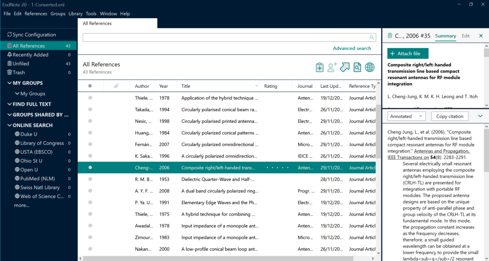

# Phần mềm quản lý tài liệu tham khảo và trích dẫn

## Lý do chọn EndNote

- EndNote là một công cụ tìm kiếm trực tuyến hữu ích
- Giúp trích xuất dữ liệu để lưu trữ tại các dịch vụ trực tuyến và các cơ sở dữ liệu
- EndNote là một kho dữ liệu tham khảo với các chức năng lưu trữ, quản lý, tìm kiếm tài liệu tham khảo cho thư viện tài liệu tham khảo của cá nhân người sử dụng
- Cho phép trích dẫn trực tiếp tài liệu tham khảo vào file word
- Giúp tạo danh mục tài liệu tham khảo và bản thảo theo định dạng của nhà xuất bản
- EndNote có thể lưu trữ và quản lý được 100.000 tài liệu tham khảo